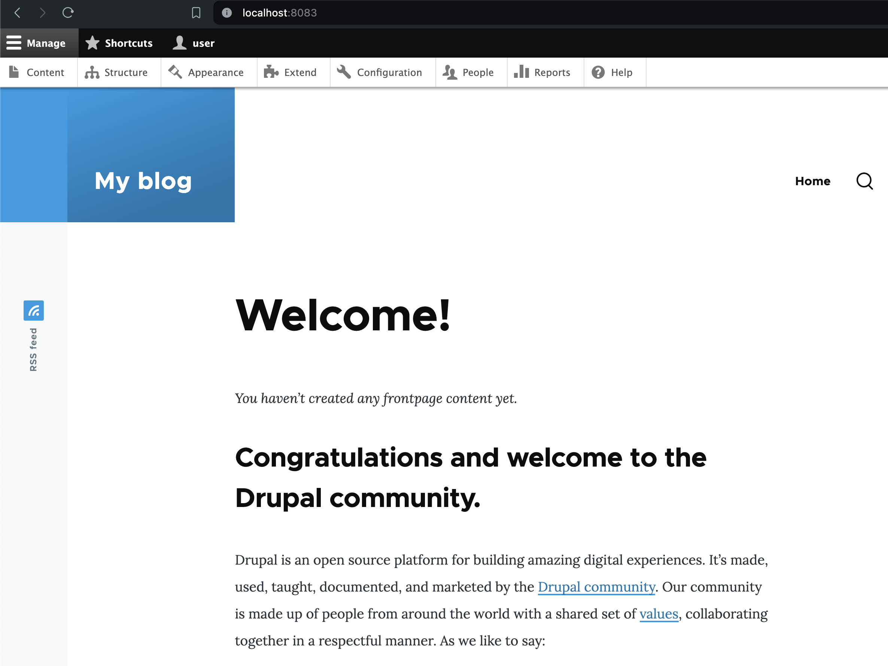

# Task 001 - Configure Auto Scaling


* Follow the instructions in the tutorial [Getting started with Amazon EC2 Auto Scaling](https://docs.aws.amazon.com/autoscaling/ec2/userguide/GettingStartedTutorial.html) to create a launch template.

* [CLI Documentation](https://docs.aws.amazon.com/cli/latest/reference/autoscaling/)

## Pre-requisites

* Networks (RTE-TABLE/SECURITY GROUP) set as at the end of the Labo2.
* 1 AMI of your Drupal instance
* 0 existing ec2 (even is in a stopped state)
* 1 RDS Database instance - started
* 1 Elastic Load Balancer - started

## Create a new launch template

|Key|Value|
|:--|:--|
|Name|LT-DEVOPSTEAM15|
|Version|v1.0.0|
|Tag|Name->same as template's name|
|AMI|Your Drupal AMI|
|Instance type|t3.micro (as usual)|
|Subnet|Your subnet A|
|Security groups|Your Drupal Security Group|
|IP Address assignation|Do not assign|
|Storage|Only 10 Go Storage (based on your AMI)|
|Advanced Details/EC2 Detailed Cloud Watch|enable|
|Purchase option/Request Spot instance|disable|

```bash
[INPUT]
aws ec2 create-launch-template \
--launch-template-name LT-DEVOPSTEAM15 \
--version-description v1.0.0 \
--tag-specifications 'ResourceType=launch-template,Tags=[{Key=Name,Value=LT-DEVOPSTEAM15}]' \
--launch-template-data '{
    "ImageId": "ami-0791e1d18934b213f",
    "InstanceType": "t3.micro",
    "KeyName": "CLD_KEY_DRUPAL_DEVOPSTEAM15",
    "SecurityGroupIds": ["sg-03f583e7906065891"],
    "BlockDeviceMappings": [
        {
            "DeviceName": "/dev/xvda",
            "Ebs": {
                "VolumeSize": 10,
                "DeleteOnTermination": true,
                "VolumeType": "gp3"
            }
        }
    ],
    "Monitoring": {
        "Enabled": true
    }
}'

aws ec2 create-launch-template \
--launch-template-name LT-DEVOPSTEAM15 \
--version-description v1.0.0 \
--tag-specifications 'ResourceType=launch-template,Tags=[{Key=Name,Value=LT-DEVOPSTEAM15}]' \
--launch-template-data '{
    "ImageId": "ami-0791e1d18934b213f",
    "InstanceType": "t3.micro",
    "KeyName": "CLD_KEY_DRUPAL_DEVOPSTEAM15",
    "NetworkInterfaces": [
        {
            "SubnetId": "subnet-0598517fbbd15df52",
            "Groups": ["sg-03f583e7906065891"],
            "AssociatePublicIpAddress": false
        }
    ],
    "BlockDeviceMappings": [
        {
            "DeviceName": "/dev/xvda",
            "Ebs": {
                "VolumeSize": 10,
                "DeleteOnTermination": true,
                "VolumeType": "gp3"
            }
        }
    ],
    "Monitoring": {
        "Enabled": true
    }
}'

[OUTPUT]
---------------------------------------------------------------------------------------------------------------------------------------------------------------------------------
|                                                                             CreateLaunchTemplate                                                                              |
+-------------------------------------------------------------------------------------------------------------------------------------------------------------------------------+
||                                                                               LaunchTemplate                                                                                ||
|+---------------------------+---------------------------------------------------+-----------------------+----------------------+-----------------------+----------------------+|
||        CreateTime         |                     CreatedBy                     | DefaultVersionNumber  | LatestVersionNumber  |   LaunchTemplateId    | LaunchTemplateName   ||
|+---------------------------+---------------------------------------------------+-----------------------+----------------------+-----------------------+----------------------+|
||  2024-04-11T14:16:04+00:00|  arn:aws:iam::709024702237:user/CLD_DEVOPSTEAM15  |  1                    |  1                   |  lt-042926f03771bc796 |  LT-DEVOPSTEAM15     ||
|+---------------------------+---------------------------------------------------+-----------------------+----------------------+-----------------------+----------------------+|
|||                                                                                   Tags                                                                                    |||
||+-------------------------------------------------+-------------------------------------------------------------------------------------------------------------------------+||
|||                       Key                       |                                                          Value                                                          |||
||+-------------------------------------------------+-------------------------------------------------------------------------------------------------------------------------+||
|||  Name                                           |  LT-DEVOPSTEAM15                                                                                                        |||
||+-------------------------------------------------+-------------------------------------------------------------------------------------------------------------------------+||
```

## Create an autoscaling group

* Choose launch template or configuration

|Specifications|Key|Value|
|:--|:--|:--|
|Launch Configuration|Name|ASGRP_DEVOPSTEAM15|
||Launch configuration|Your launch configuration|
|Instance launch option|VPC|Refer to infra schema|
||AZ and subnet|AZs and subnets a + b|
|Advanced options|Attach to an existing LB|Your ELB|
||Target group|Your target group|
|Health check|Load balancing health check|Turn on|
||health check grace period|10 seconds|
|Additional settings|Group metrics collection within Cloud Watch|Enable|
||Health check grace period|10 seconds|
|Group size and scaling option|Desired capacity|1|
||Min desired capacity|1|
||Max desired capacity|4|
||Policies|Target tracking scaling policy|
||Target tracking scaling policy Name|TTP_DEVOPSTEAM15|
||Metric type|Average CPU utilization|
||Target value|50|
||Instance warmup|30 seconds|
||Instance maintenance policy|None|
||Instance scale-in protection|None|
||Notification|None|
|Add tag to instance|Name|AUTO_EC2_PRIVATE_DRUPAL_DEVOPSTEAM15|

```bash
[INPUT]
aws autoscaling create-auto-scaling-group \
--auto-scaling-group-name ASGRP_DEVOPSTEAM15 \
--launch-template LaunchTemplateId=lt-042926f03771bc796,Version='$Latest' \
--vpc-zone-identifier "subnet-0598517fbbd15df52,subnet-016d3f0da8ee1a2b5" \
--target-group-arns "arn:aws:elasticloadbalancing:eu-west-3:709024702237:targetgroup/TG-DEVOPSTEAM15/9400f8739ae3066d" \
--health-check-type ELB \
--health-check-grace-period 10 \
--default-instance-warmup 10 \
--min-size 1 \
--max-size 4 \
--desired-capacity 1 \
--tags "ResourceId=ASGRP_DEVOPSTEAM15,ResourceType=auto-scaling-group,Key=Name,Value=AUTO_EC2_PRIVATE_DRUPAL_DEVOPSTEAM15,PropagateAtLaunch=true"

aws autoscaling put-scaling-policy \
--auto-scaling-group-name ASGRP_DEVOPSTEAM15 \
--policy-name TTP_DEVOPSTEAM15 \
--policy-type TargetTrackingScaling \
--estimated-instance-warmup 30 \
--target-tracking-configuration '{
    "PredefinedMetricSpecification": {
        "PredefinedMetricType": "ASGAverageCPUUtilization"
    },
    "TargetValue": 50.0
}'

[OUTPUT]
----------------------------------------------------------------------------------------------------------------------------------------------------------------------------------------------------------------------------
|                                                                                                     PutScalingPolicy                                                                                                     |
+--------------+-----------------------------------------------------------------------------------------------------------------------------------------------------------------------------------------------------------+
|  PolicyARN   |  arn:aws:autoscaling:eu-west-3:709024702237:scalingPolicy:775ac8cb-46a1-41b6-a84a-e59d0fb6acf4:autoScalingGroupName/ASGRP_DEVOPSTEAM15:policyName/TTP_DEVOPSTEAM15                                        |
+--------------+-----------------------------------------------------------------------------------------------------------------------------------------------------------------------------------------------------------+
||                                                                                                         Alarms                                                                                                         ||
|+-----------------------------------------------------------------------------------------------------------------------------------+------------------------------------------------------------------------------------+|
||                                                             AlarmARN                                                              |                                     AlarmName                                      ||
|+-----------------------------------------------------------------------------------------------------------------------------------+------------------------------------------------------------------------------------+|
||  arn:aws:cloudwatch:eu-west-3:709024702237:alarm:TargetTracking-ASGRP_DEVOPSTEAM15-AlarmHigh-4566a08e-459f-401f-88f3-094035f13043 |  TargetTracking-ASGRP_DEVOPSTEAM15-AlarmHigh-4566a08e-459f-401f-88f3-094035f13043  ||
||  arn:aws:cloudwatch:eu-west-3:709024702237:alarm:TargetTracking-ASGRP_DEVOPSTEAM15-AlarmLow-fc997ee4-8493-4f99-b12d-d74452a65b44  |  TargetTracking-ASGRP_DEVOPSTEAM15-AlarmLow-fc997ee4-8493-4f99-b12d-d74452a65b44   ||
|+-----------------------------------------------------------------------------------------------------------------------------------+------------------------------------------------------------------------------------+|
```

* Result expected

The first instance is launched automatically.

Test ssh and web access.

```
[INPUT]
Host cld-srv-auto
  HostName 10.0.15.137
  ProxyJump cld-dmz
  IdentityFile ~/.ssh/cld_drupal
  User bitnami
  LocalForward 8083 localhost:8080

[OUTPUT]
The authenticity of host '10.0.15.137 (<no hostip for proxy command>)' can't be established.
ED25519 key fingerprint is SHA256:flnUGv3DfnlUpB4yOs8Fs4mtrp/GQngQQbkDMQdj9YQ.
This key is not known by any other names.
Are you sure you want to continue connecting (yes/no/[fingerprint])? yes
Warning: Permanently added '10.0.15.137' (ED25519) to the list of known hosts.
Linux ip-10-0-15-137 5.10.0-28-cloud-amd64 #1 SMP Debian 5.10.209-2 (2024-01-31) x86_64

The programs included with the Debian GNU/Linux system are free software;
the exact distribution terms for each program are described in the
individual files in /usr/share/doc/*/copyright.

Debian GNU/Linux comes with ABSOLUTELY NO WARRANTY, to the extent
permitted by applicable law.
       ___ _ _                   _
      | _ |_) |_ _ _  __ _ _ __ (_)
      | _ \ |  _| ' \/ _` | '  \| |
      |___/_|\__|_|_|\__,_|_|_|_|_|
  
  *** Welcome to the Bitnami package for Drupal 10.2.3-1        ***
  *** Documentation:  https://docs.bitnami.com/aws/apps/drupal/ ***
  ***                 https://docs.bitnami.com/aws/             ***
  *** Bitnami Forums: https://github.com/bitnami/vms/           ***
Last login: Thu Mar 21 19:44:24 2024 from 10.0.0.5
bitnami@ip-10-0-15-137:~$ 
```


