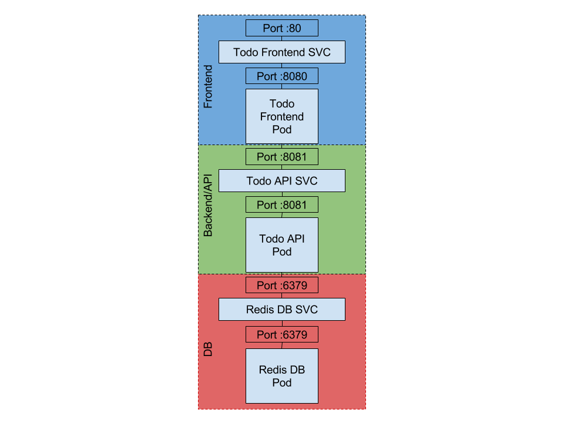

# Task 1 - Deploy the application on a local test cluster

In this task you will set up a local Kubernetes test cluster and deploy an example application to it.



The goal of the provided example application is to store and edit a To Do list. The application consists of a simple Web UI (Frontend) that uses a REST API (API service) to access a Key-Value storage service (Redis). Ports to be used for Pods and Services are shown in the figure.

The required Docker images are provided on [Docker Hub](https://hub.docker.com):

  * Frontend: [icclabcna/ccp2-k8s-todo-frontend]( https://hub.docker.com/r/icclabcna/ccp2-k8s-todo-frontend)
  * API backend: [icclabcna/ccp2-k8s-todo-api](https://hub.docker.com/r/icclabcna/ccp2-k8s-todo-api)
  * Redis 3.2.11-alpine: [redis:3.2.11-alpine](https://hub.docker.com/layers/library/redis/3.2.11-alpine/images/sha256-ca0b6709748d024a67c502558ea88dc8a1f8a858d380f5ddafa1504126a3b018?context=explore)

## Subtask 1.1 - Installation of Minikube

[Minikube](https://github.com/kubernetes/minikube) is a tool that makes it easy to run Kubernetes locally. Minikube creates a single-node Kubernetes cluster inside a virtual machine on your local machine.

Minikube requires a container or virtual machine manager, such as Docker, Hyperkit, Hyper-V, KVM, Parallels, Podman, VirtualBox, or VMWare.

Install Minikube by following the instructions in [minikube start](https://minikube.sigs.k8s.io/docs/start/).

> [!CAUTION]
>
> After installation, Minikube may tell you that you have an old version of `kubectl` installed and offer to download the newest version. For example, if you have the Google Cloud SDK, it already installed `kubectl`. In this case it is better to update via the tool that installed it: `gcloud components update`. Same applies if you have installed `kubectl` via a package manager such as Homebrew, Chocolatey or Scoop.

Verify successful installation by running `minikube version`. You should see output similar to

```sh
$ minikube version: v1.25.2
```


## Subtask 1.2 - Installation of kubectl

[kubectl](https://kubernetes.io/docs/reference/kubectl/overview/) is a command line tool to control Kubernetes clusters.

If you have installed the Google Cloud SDK you already have `kubectl` (in this case do a `gcloud components update` to get the latest version).

If you don't have `kubectl` you can install it through `minikube`:

```sh
$ minikube kubectl -- get po -A
```

Verify successful installation by running `kubectl version`. You should see something similar to

```sh
Client Version: version.Info{Major:"1", Minor:"17+", [...]
Server Version: version.Info{Major:"1", Minor:"23", [...]
```

> [!NOTE]
>
> Note that _Client Version_ is the version of `kubectl` while _Server Version_ refers to the version of the Kubernetes cluster. The two version numbers should be close, but it is OK if they are not the same.


## Subtask 1.3 - Create a one-node cluster on your local machine

Create and start a one-node cluster. 

> [!WARNING]
>
> If your machine has an ARM processor add to the `start` command the option `-–driver=docker` so that minikube runs Kubernetes in a Docker container instead of a VirtualBox VM.

Run :

```sh
$ minikube start
minikube v1.25.2 on Darwin 12.3.1
Automatically selected the docker driver. Other choices: hyperkit, virtualbox, ssh
Starting control plane node minikube in cluster minikube
Pulling base image ...
Downloading Kubernetes v1.23.3 preload ...
[...]
Done! kubectl is now configured to use "minikube" cluster and "default" namespace by default
```

This will download a VM image for the Kubernetes cluster and start it. Also the tool `kubectl` is configured to use this cluster by default.

Examine the cluster:

```sh
$ kubectl cluster-info
```

You should see a running _Kubernetes master (Control Plane)_.

To view the nodes in the cluster, run the `kubectl get nodes` command:

```sh
$ kubectl get nodes
```

This command shows all nodes that can be used to host our applications. Now we have only one node, and we can see that its status is __Ready__ (it is ready to accept applications for deployment).

Detailed info on the available `kubectl` commands, syntax and parameters can be found in the `kubectl` cheat sheet: <https://kubernetes.io/docs/reference/kubectl/cheatsheet/>

### Optional: Access the Kubernetes Dashboard

The [Kubernetes Dashboard](https://github.com/kubernetes/dashboard/) gives you a graphical web interface to your Kubernetes cluster. It is itself bundled as a Pod, therefore it runs on the cluster as any other Pod (although in a separate namespace). The Dashboard is already included with Minikube.

To access Dashboard, open a separate terminal and run:

```sh
$ minikube dashboard
```

This will enable Dashboard and open it in the default browser.


## Subtask 1.4 - Deploy the application

Next you create the configuration and deploy the three tiers of the application to the Kubernetes cluster.

### Deploy the Redis Service and Pod

Use the following commands to deploy Redis using the provided configuration files:

```sh
$ kubectl create -f redis-svc.yaml
$ kubectl create -f redis-pod.yaml
```

and verify it is up and running and on which ports using the command `kubectl get all`.

> [!TIP]
>
> To zoom in on a Kubernetes object and see much more detail try `kubectl describe pod/redis` for the Pod and `kubectl describe svc/redis-svc` for the Service.

### Deploy the ToDo-API Service and Pod

Using the `redis-svc.yaml` file as example and information from `api-pod.yaml`, create the `api-svc.yaml` configuration file for the API Service. The Service has to expose port: 8081 and connect to the port of the API Pod.

Be careful with the indentation of the YAML files. If your code editor has a YAML mode, enable it.

  * Deploy and verify the API-Service and Pod (similar to the Redis ones) and verify that they are up and running on the correct ports.

### Deploy the Frontend Pod

Using the `api-pod.yaml` file as an example, create the `frontend-pod.yaml` configuration file that starts the UI Docker container in a Pod.

  * Docker image for frontend container on Docker Hub is [icclabcna/ccp2-k8s-todo-frontend](https://hub.docker.com/r/icclabcna/ccp2-k8s-todo-frontend)

Note that the container runs on port: 8080

It also needs to be initialized with the following environment variables (check how `api-pod.yaml` defines environment variables):

  * `API_ENDPOINT_URL`: URL where the API can be accessed e.g., <http://localhost:9000>
    * *What value must be set for this URL ?*

> Hint: remember that anything you define as a Service will be assigned a DOMAIN that is visible via DNS everywhere in the cluster and a PORT.

  * Deploy the Pod using `kubectl`.

### Verify the ToDo application

Now you can verify the the ToDo application is working correctly by connecting to the Frontend Pod. As the Pod's IP address is only accessible from inside the cluster, we have to use a trick.

The `kubectl` program is able to establish a secure tunnel between your local machine and the cluster. It listens on a port on your local machine and as soon as someone (e.g., your browser) establishes a TCP connection to that port, `kubectl` forwards the connection to the cluster. This is called _port forwarding_. There is one limitation, though: the TCP connection can only be forwarded to a Pod.

To start port forwarding, run

```sh
$ kubectl port-forward pod_name local_port:pod_port
```

where `pod_name` is the name of the Frontend Pod, `pod_port` is the port where the Frontend Pod is listening, and `local_port` is a free port on your local machine, say 8001.

The command blocks and keeps running to keep the tunnel open. Using your browser or another terminal window you can now access the Pod at <http://localhost:local_port>.

You should see the application's main page titled __Todos V2__ and you should be able to create a new To Do item. Be patient, the application will be very slow at first.

## Deliverables

Document any difficulties you faced and how you overcame them. Copy the object descriptions into the lab report.

> // TODO

```````
// TODO object descriptions
```````

```yaml
# api-svc.yaml
```

```yaml
# frontend-pod.yaml
```

> [!TIP]
>
> ### Troubleshooting
>
> Several things can be misconfigured. Remember that there are two Service dependencies:
>
>   * the Frontend forwarding requests to the (not externally accessible) API Service;
>   * the API Service accessing the Redis Service (also only accessible from within the cluster).
>
> #### Consulting the Pod logs
>
> You can look at the Pod logs to find out where the problem is. You can see the logs of a Pod using:
>
> ```sh
> $ kubectl logs -f pod_name
> ```
>
> #### Connecting to a Pod
>
> You may want to test if a Pod is responding correctly on its port. Use `kubectl port-forward` as described at the end of task 1. 
>
> #### Running a command in a container
>
> A handy way to debug is to log in to a container and see whether the required services are visible to the container.
>
> You can run a command on a (container in a) Pod using:
>
> ```sh
> $ kubectl exec -it pod_name <command>
> ```
>
> E.g. use `kubectl exec -it pod-name bash` to start a Bash shell inside the container.
>
> Container images tend to contain only the strict minimum to run the application. If you are missing a tool such as `curl` you can install it (assuming a Debian-family distribution):
>
> ```sh
> $ apt-get update
> $ apt-get install curl
> ```
> 