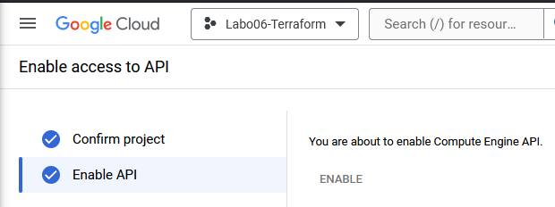
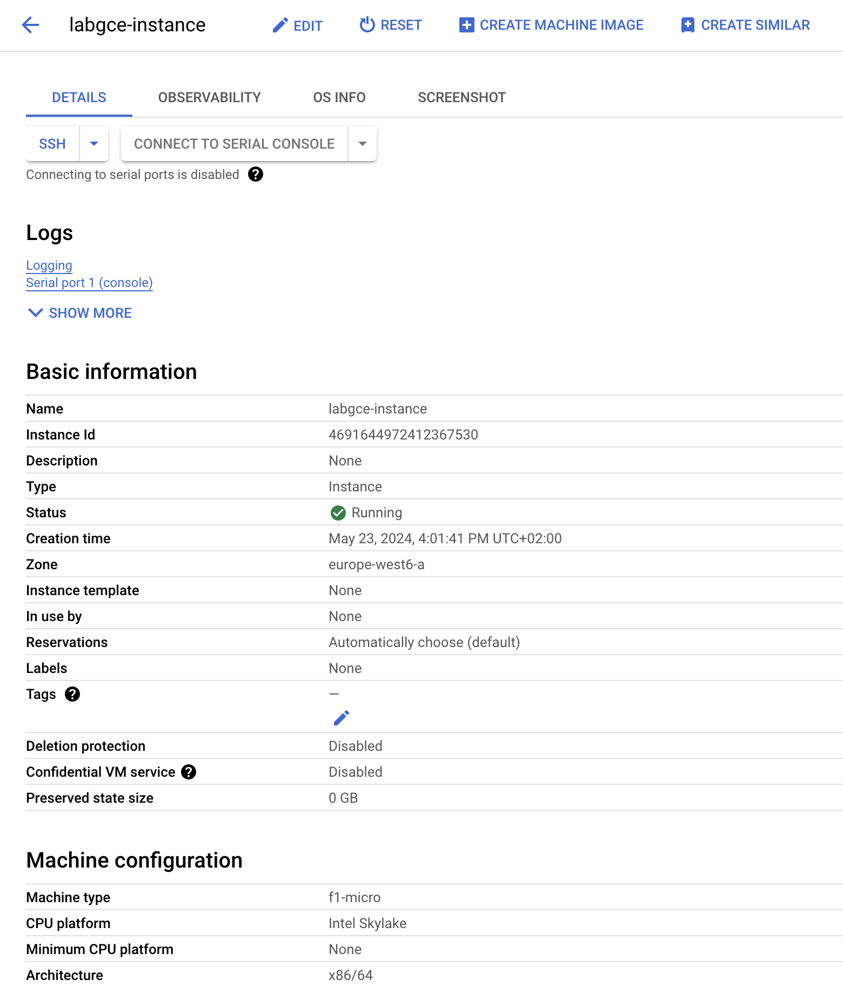

# Task 2: Create a cloud infrastructure on Google Compute Engine with Terraform

In this task you will create a simple cloud infrastructure that consists of a single VM on Google Compute Engine. It will be
managed by Terraform.

This task is highly inspired from the following guide: [Get started with Terraform](https://cloud.google.com/docs/terraform/get-started-with-terraform).

Create a new Google Cloud project. Save the project ID, it will be used later.

* Name: __labgce__

As we want to create a VM, you need to enable the Compute Engine API:

* [Navigate to google enable api page](https://console.cloud.google.com/flows/enableapi?apiid=compute.googleapis.com)



Terraform needs credentials to access the Google Cloud API. Generate and download the Service Account Key:

* Navigate to __IAM & Admin__ > __Service Accounts__. 
* Click on the default service account > __Keys__ and __ADD KEY__ > __Create new key__ (JSON format). 
* On your local machine, create a directory for this lab. In it, create a subdirectory named `credentials` and save the key under the name `labgce-service-account-key.json`, it will be used later.

Generate a public/private SSH key pair that will be used to access the VM and store it in the `credentials` directory:

    ssh-keygen \
      -t ed25519 \
      -f labgce-ssh-key \
      -q \
      -N "" \
      -C ""

At the root of your lab directory, create a `terraform` directory and get the [backend.tf](./appendices/backend.tf), [main.tf](./appendices/main.tf), [outputs.tf](./appendices/outputs.tf) and [variables.tf](./appendices/variables.tf) files. 

These files allow you to deploy a VM, except for a missing file, which you have to provide. Your task is to explore the provided files and using the [Terraform documentation](https://www.terraform.io/docs) understand what these files do. 

The missing file `terraform.tfvars` is supposed to contain values for variables used in the `main.tf` file. Your task is to find out what these values should be. You can freely choose the user account name and the instance name (only lowercase letters, digits and hyphen allowed).

You should have a file structure like this:

    .
    ├── credentials
    │   ├── labgce-service-account-key.json
    │   ├── labgce-ssh-key
    │   └── labgce-ssh-key.pub
    └── terraform
        ├── backend.tf
        ├── main.tf
        ├── outputs.tf
        ├── terraform.tfvars
        └── variables.tf

There are two differences between Google Cloud and AWS that you should know about:

1. Concerning the default Linux system user account created on a VM: In AWS, newly created VMs have a user account that is always named the same for a given OS. For example, Ubuntu VMs have always have a user account named `ubuntu`, CentOS VMs always have a user account named `ec2-user`, and so on. In Google Cloud, the administrator can freely choose the name of the user account.

2. Concerning the public/private key pair used to secure access to the VM: In AWS you create the key pair in AWS and then download the private key. In Google Cloud you create the key pair on your local machine and upload the public key to Google Cloud.

The two preceding parameters are configured in Terraform in the `metadata` section of the `google_compute_instance` resource description. For example, a user account named `fred` with a public key file located at `/path/to/file.pub` is configured as

    metadata = {
      ssh-keys = "fred:${file("/path/to/file.pub")}"
    }
    
This is already taken care of in the provided `main.tf` file.

You can now initialize the Terraform state:

    cd terraform
    terraform init

[OUTPUT]
```bash
❯ terraform init

Initializing the backend...

Successfully configured the backend "local"! Terraform will automatically
use this backend unless the backend configuration changes.

Initializing provider plugins...
- Finding latest version of hashicorp/google...
- Installing hashicorp/google v5.30.0...
- Installed hashicorp/google v5.30.0 (signed by HashiCorp)

Terraform has created a lock file .terraform.lock.hcl to record the provider
selections it made above. Include this file in your version control repository
so that Terraform can guarantee to make the same selections by default when
you run "terraform init" in the future.

Terraform has been successfully initialized!

You may now begin working with Terraform. Try running "terraform plan" to see
any changes that are required for your infrastructure. All Terraform commands
should now work.

If you ever set or change modules or backend configuration for Terraform,
rerun this command to reinitialize your working directory. If you forget, other
commands will detect it and remind you to do so if necessary.
```

* What files were created in the `terraform` directory? Make sure to look also at hidden files and directories (`ls -a`).

[OUTPUT]
```bash
- .terraform/providers/registry.terraform.io/hashicorp/google/
- .terraform/terraform.tfstate
- .terraform.lock.hcl
```

* What are they used for?

|File/FolderName|Explanation|
|:--:|:--:|
|.terraform/providers/|Stores the provider plugins used by Terraform to interact with the cloud provider. In our case, it only contains the Google Cloud provider.|
|.terraform/terraform.tfstate|Stores the state of the infrastructure.|
|.terraform.lock.hcl|Lock file to pin the provider version, providing reproducibility to the terraform configuration.|

* Check that your Terraform configuration is valid:

```bash
terraform validate
```

[OUTPUT]
```bash
❯ terraform validate

Success! The configuration is valid.
```

* Create an execution plan to preview the changes that will be made to your infrastructure and save it locally:

```bash
terraform plan -input=false -out=.terraform/plan.cache
```

* Copy the command result in a file named "planCache.json" and add it to your lab repo.

```
As the command result is not a valid JSON syntax, the output is instead available in `.terraform/planCache.txt`
```

* If satisfied with your execution plan, apply it:

```bash
terraform apply -input=false .terraform/plan.cache
```

* Copy the command result in a file name "planCacheApplied.txt"

```
The output is available in `.terraform/planCacheApplied.txt`
```

* Test access via ssh

[INPUT]
```bash
ssh -i credentials/labgce-ssh-key labgce-user@34.65.105.144
```

[OUTPUT]
```
The authenticity of host '34.65.105.144 (34.65.105.144)' can't be established.
ED25519 key fingerprint is SHA256:pOJjs3QsIoKzs4Lqa9xVeAkT8McjwqcOS1qLY/avy88.
This key is not known by any other names.
Are you sure you want to continue connecting (yes/no/[fingerprint])? yes
Warning: Permanently added '34.65.105.144' (ED25519) to the list of known hosts.
Welcome to Ubuntu 20.04.6 LTS (GNU/Linux 5.15.0-1060-gcp x86_64)

 * Documentation:  https://help.ubuntu.com
 * Management:     https://landscape.canonical.com
 * Support:        https://ubuntu.com/pro

 System information as of Thu May 23 13:29:26 UTC 2024

  System load:  0.0               Processes:             93
  Usage of /:   19.1% of 9.51GB   Users logged in:       0
  Memory usage: 34%               IPv4 address for ens4: 10.172.0.2
  Swap usage:   0%

Expanded Security Maintenance for Applications is not enabled.

0 updates can be applied immediately.

Enable ESM Apps to receive additional future security updates.
See https://ubuntu.com/esm or run: sudo pro status


The programs included with the Ubuntu system are free software;
the exact distribution terms for each program are described in the
individual files in /usr/share/doc/*/copyright.

Ubuntu comes with ABSOLUTELY NO WARRANTY, to the extent permitted by
applicable law.

labgce-user@labgce-instance:~$
```

If no errors occur, you have successfully managed to create a VM on Google Cloud using Terraform. You should see the IP of the Google Compute instance in the console. Save the instance IP, it will be used later.

After launching make sure you can SSH into the VM using your private
key and the Linux system user account name defined in the `terraform.tfvars` file.

Deliverables:

* Explain the usage of each provided file and its contents by directly adding comments in the file as needed (we must ensure that you understood what you have done). In the file `variables.tf` fill the missing documentation parts and link to the online documentation. Copy the modified files to the report.

```
# main.tf

# Provider configuration for Google Cloud Platform
provider "google" {
  project     = var.gcp_project_id
  region      = "europe-west6-a"
  credentials = file("${var.gcp_service_account_key_file_path}")
}

# Resource definition for a Google Compute Engine instance
resource "google_compute_instance" "default" {
  name         = var.gce_instance_name
  machine_type = "f1-micro"
  zone         = "europe-west6-a"

  # Metadata includes SSH keys for access
  metadata = {
    ssh-keys = "${var.gce_instance_user}:${file("${var.gce_ssh_pub_key_file_path}")}"
  }

  # Boot disk configuration
  boot_disk {
    initialize_params {
      image = "ubuntu-os-cloud/ubuntu-2004-lts"
    }
  }

  # Network interface with access configuration for external IP
  network_interface {
    network = "default"

    access_config {
      # Include this section to give the VM an external IP address
    }
  }
}

# Resource definition for a firewall rule to allow SSH traffic
resource "google_compute_firewall" "ssh" {
  name          = "allow-ssh"
  network       = "default"
  source_ranges = ["0.0.0.0/0"]
  allow {
    ports    = ["22"]
    protocol = "tcp"
  }
}

# Resource definition for a firewall rule to allow HTTP traffic
resource "google_compute_firewall" "http" {
  name          = "allow-http"
  network       = "default"
  source_ranges = ["0.0.0.0/0"]
  allow {
    ports    = ["80"]
    protocol = "tcp"
  }
}
```

```
# variables.tf

# Variable to hold the Google Cloud Project ID
variable "gcp_project_id" {
  description = "The ID of the GCP project."
  type        = string
}

# Variable to hold the path to the service account key file
variable "gcp_service_account_key_file_path" {
  description = "The path to the GCP service account key file."
  type        = string
}

# Variable to hold the name of the Google Compute Engine instance
variable "gce_instance_name" {
  description = "The name of the GCE instance."
  type        = string
}

# Variable to hold the username for the Google Compute Engine instance
variable "gce_instance_user" {
  description = "The username for the GCE instance."
  type        = string
}

# Variable to hold the path to the SSH public key file
variable "gce_ssh_pub_key_file_path" {
  description = "The path to the SSH public key file."
  type        = string
}
```

```
# terraform.tfvars

# Google Cloud Project ID
gcp_project_id = "rock-terra-424212-i6"

# Path to the service account key file
gcp_service_account_key_file_path = "../credentials/labgce-service-account-key.json"

# Name of the Google Compute Engine instance
gce_instance_name = "labgce-instance"

# Username for the instance (used in SSH metadata)
gce_instance_user = "labgce-user"

# Path to your SSH public key file
gce_ssh_pub_key_file_path = "../credentials/labgce-ssh-key.pub"
```

```
# backend.tf

# Backend configuration for Terraform to store state in Google Cloud Storage
terraform {
  backend "local" {
  }
}
```

```
# outputs.tf

# Output the external IP address of the Google Compute Engine instance
output "instance_external_ip" {
  description = "The external IP address of the Google Compute Engine instance."
  value       = google_compute_instance.default.network_interface[0].access_config[0].nat_ip
}
```

* Explain what the files created by Terraform are used for.

```
- `main.tf`: Contains the main configuration of resources to be managed by Terraform.
- `variables.tf`: Defines the variables used in the configuration, including their descriptions and types.
- `terraform.tfvars`: Provides values for the variables defined in `variables.tf`.
- `backend.tf`: Configures the backend for storing the Terraform state. In this case, the local backend.
- `outputs.tf`: Specifies the outputs from the Terraform configuration, such as the external IP address of a VM instance.
```

* Where is the Terraform state saved? Imagine you are working in a team and the other team members want to use Terraform, too, to manage the cloud infrastructure. Do you see any problems with this? Explain.

```
The Terraform state is saved locally in the `.terraform` directory. If working in a team, the state should be stored in a shared location, such as Google Cloud Storage, to allow all team members to access and manage the infrastructure. Otherwise, each team member would have their own state file, leading to conflicts and inconsistencies in the infrastructure.
```

* What happens if you reapply the configuration (1) without changing `main.tf` (2) with a change in `main.tf`? Do you see any changes in Terraform's output? Why? Can you think of examples where Terraform needs to delete parts of the infrastructure to be able to reconfigure it?

```
1. If we run `terraform apply` without changing `main.tf`, Terraform will not make any changes to the infrastructure. The output will show that no changes are required, as the current state matches the desired state defined in the configuration.
2. If we make a change in `main.tf`, such as modifying the instance image, Terraform will detect the changes and show the differences in the output. It will then apply the changes to the infrastructure to match the new desired state.
```

* Explain what you would need to do to manage multiple instances.

```
To manage multiple instances, we can define multiple resource blocks for Google Compute Engine instances in the `main.tf` file. Each resource block would represent a separate instance with its configuration. We can also use count or for_each meta-arguments to create multiple instances based on a single resource block definition. Additionally, we can use modules to encapsulate the instance configuration and reuse it across multiple instances.
```

* Take a screenshot of the Google Cloud Console showing your Google Compute instance and put it in the report.



* Deliver a folder "terraform" with your configuration.
