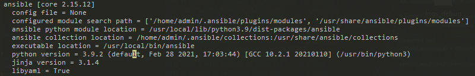

# Task 3: Install Ansible

Now that you have created a VM on Google Cloud, we can configure it to add all the required software for our needs. For that we are going to use Ansible. In this task you will install Ansible on your local machine.

The installation procedure depends on the OS on your local machine. If you run Windows it is recommended you use a Linux installation to run Ansible (Windows Subsystem for Linux with Debian/Ubuntu is fine).

To install on Linux: Use Python's package manager `pip`:

```bash
sudo pip install ansible
```

To install on macOS: Use the Homebrew package manager `brew`:

```bash
brew install ansible
```

Verify that Ansible is installed correctly by running:

```bash
ansible --version
```

//TODO
[OUTPUT]
```bash
```

You should see output similar to the following:

