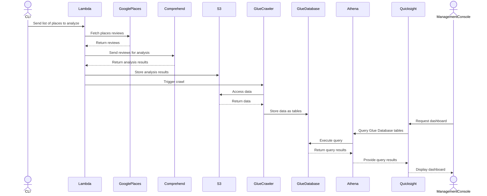

# Google Places reviews monitoring with Amazon Comprehend

## POC Objectives

Validate the use of Amazon Comprehend for Google Places Reviews sentiment analysis to detect trends and get insights.

## Infra Architecture

- Logical Components:
  - User interface for data visualization.
  - Backend for collecting and processing reviews.
  - Amazon Comprehend for sentiment analysis and entity extraction.
  - Database for storing analyzed data.
- Ports/Protocols:
  - HTTPS for API requests and user interface.
- Type of Cloud: Software as a Service (SaaS).
  - AWS for hosting services and utilizing Amazon Comprehend, as well as analysis visualization.
  - Google Cloud for Google Places API.

## Scenario

### STEP 01

```text
//given -> the user has configured a list of places to monitor

//when -> the user send a request to the application's backend to collect the latest reviews

//then -> the application's backend collects the latest reviews for the configured places
```

### STEP 02

```text
//given -> the application's backend has collected the latest reviews

//when -> the backend parses and sends the reviews to Amazon Comprehend for analysis

//then -> Amazon Comprehend performs entity recognition, sentiment analysis, and targeted sentiment analysis on the reviews
```

### STEP 03

```text
//given -> the backend has received the analyzed reviews from Amazon Comprehend

//when -> the backend parses and stores the analyzed reviews in the database

//then -> the backend confirms to the user that the analyzed reviews have been stored
```

### STEP 04

```text
//given -> the user has requested to view the analyzed reviews

//when -> the user sends a request to the application's backend to view the analyzed reviews

//then -> the backend retrieves the analyzed reviews from the database and displays them to the user
```

## Components diagram


## Sequence diagram



## Cost

### Cost per Place per Request

| Service                  | Description                                     | Cost             |
|--------------------------|-------------------------------------------------|------------------|
| Google Places API        | Basic Text Search Request                       | $0.032           |
|                          | Preferred Place Details Request                 | $0.017           |
| Amazon Lambda            | Request (5000ms, 128MB RAM, 512MB storage)      | $0.0000002       |
| Amazon Comprehend        | Entity Recognition (5x4096 characters)          | $0.02            |
|                          | Sentiment Analysis (5x4096 characters)          | $0.02            |
|                          | Targeted Sentiment Analysis (5x4096 characters) | $0.02            |
| Amazon S3                | 150 PUT requests (100B per document)            | $0.0008          |
|                          | 150 GET requests (100B per document)            | $0.0001          |
| Amazon Glue              | Crawler (1x, 1mn runtime)                       | $0.7             |
| Amazon Athena            | Query (1x per Dashboard, 5KB scanned)           | $0.00000002      |

Subtotal per Place per Request: ~$0.8

### Monthly Cost

| Service                  | Description                                     | Cost             |
|--------------------------|-------------------------------------------------|------------------|
| Amazon Quicksight        | 1x Reader, 1x Author, Hourly Alert (1 month)    | $25              |

Subtotal Monthly Cost: ~$25

### Total Cost

Given one request per place per day, the total cost per month for monitoring one place is as follows:

Total Cost per Place per Month: $25 + (30 days * 1 * $0.8) = ~$49

### Cost Reduction

//TODO

## Return of experience

### Difficulties

The main difficulty encountered during the PoC was finding a good source of data to give Comprehend to analyze. As its applications are targeted on opinionated texts, it was necessary to find a data source where poeple would express themselves to fully showcase the capabilities of the service.

Our initial idea was to use Twitter API to fetch tweets about specific keywords, but we found out that the free tier of the service was too limited for our needs. The second option was to use news articles from queriable RSS feeds, but by nature, news articles are not opinionated enough for Comprehend to provide meaningful insights. Finally, we decided to use Google Places reviews, given a list of places to monitor. This has the advantage of leveraging the Google Search algorithm to easily find the places corresponding to the keywords we are interested in, and the reviews are usually opinionated enough to be interesting to analyze. The downside is that we are limited by the Google Places API to five reviews we can fetch per place, which is not enough to give a full picture of each place's reputation, but still allows us to demonstrate the capabilities of Amazon Comprehend. Additionally, should this project be utilized in a real-world scenario, the business owner would be able to use Google Business API, which allows for all reviews to be fetched.

### Positive aspects

The positive aspects of the PoC were the ease of use of the services involved. The integration between the services was seamless, and the documentation was clear and easy to follow. The services provided by AWS are well-documented and have a lot of examples and tutorials available, which makes it easy to get started with them. The services themselves are also very powerful and provide a lot of functionality out of the box, which makes it easy to build complex applications without having to reinvent the wheel.

As the PoC has mainly been developed locally using Python and AWS `boto3` SDK, the development process was very smooth and we were able to quickly iterate on the code and test the different components of the system. Once the code was ready, deploying it to AWS was straightforward, as AWS Lambda allowed us to integrate the different components of the system without having to worry about the underlying infrastructure. Lambda also offers triggers to run the code either on a schedule or in response to an Amazon Gateway API request, which makes it easy to build serverless applications that are scalable and cost-effective. This would allow us to additionally implement a web interface to allow the user to configure the places to monitor and view the analyzed reviews.

### Conclusion

Overall, the PoC was a success and we were able to demonstrate the capabilities of Amazon Comprehend for sentiment analysis and entity recognition. The integration with other AWS services was seamless and the development process was simple. The cost of the project is also reasonable, and the application could be easily scaled to monitor more places. As explained before, it also offers room for improvement, such as implementing a web interface to allow the user to configure the places to monitor and view the analyzed reviews all in one place, as well as finding a better source of data to give Comprehend to analyze.
