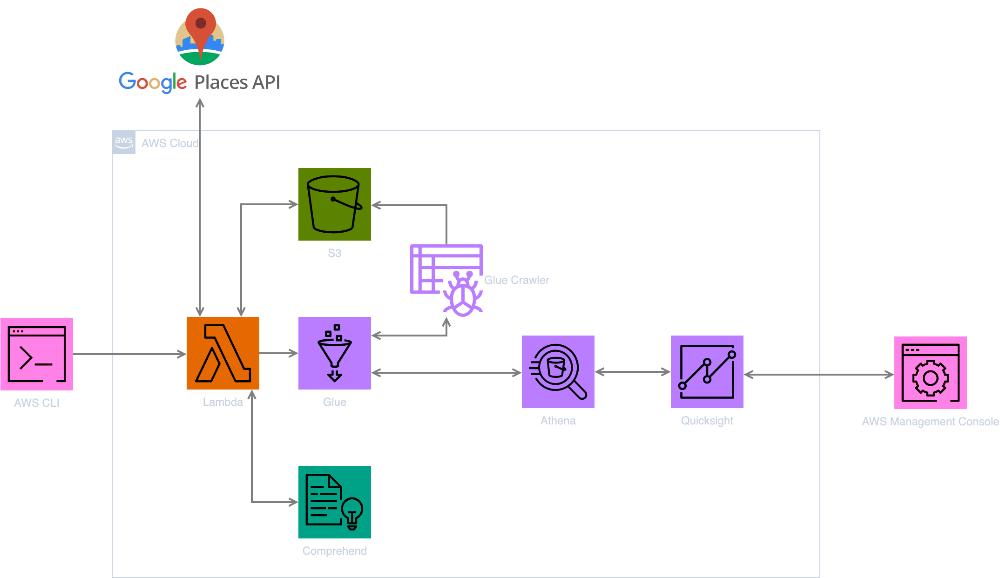

# Google Places reviews monitoring with Amazon Comprehend

## POC Objectives

Validate the use of Amazon Comprehend for Google Places Reviews sentiment analysis to detect trends and get insights.

## Infra Architecture

- Logical Components:
  - User interface for data visualization.
  - Backend for collecting and processing reviews.
  - Amazon Comprehend for sentiment analysis and entity extraction.
  - Database for storing analyzed data.
- Ports/Protocols:
  - HTTPS for API requests and user interface.
- Type of Cloud: Software as a Service (SaaS).
  - AWS for hosting services and utilizing Amazon Comprehend, as well as analysis visualization.
  - Google Cloud for Google Places API.

## Scenario

### STEP 01

```text
//given -> the user has configured a list of places to monitor

//when -> the user send a request to the application's backend to collect the latest reviews

//then -> the application's backend collects the latest reviews for the configured places
```

### STEP 02

```text
//given -> the application's backend has collected the latest reviews

//when -> the backend parses and sends the reviews to Amazon Comprehend for analysis

//then -> Amazon Comprehend performs entity recognition, sentiment analysis, and targeted sentiment analysis on the reviews
```

### STEP 03

```text
//given -> the backend has received the analyzed reviews from Amazon Comprehend

//when -> the backend parses and stores the analyzed reviews in the database

//then -> the backend confirms to the user that the analyzed reviews have been stored
```

### STEP 04

```text
//given -> the user has requested to view the analyzed reviews

//when -> the user sends a request to the application's backend to view the analyzed reviews

//then -> the backend retrieves the analyzed reviews from the database and displays them to the user
```

## Components diagram



## Sequence diagram


## Cost

<analysis of load-related costs.>

<option to reduce or adapt costs (practices, subscription)>

## Return of experience

<take a position on the poc that has been produced.>

<Did it validate the announced objectives?>
